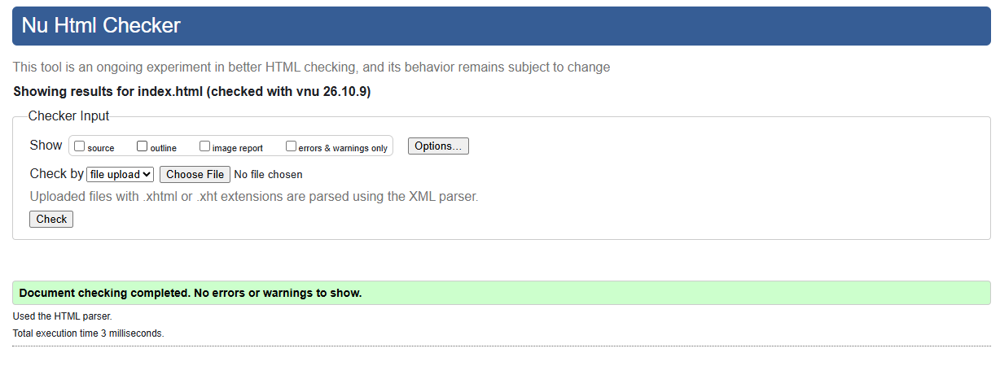
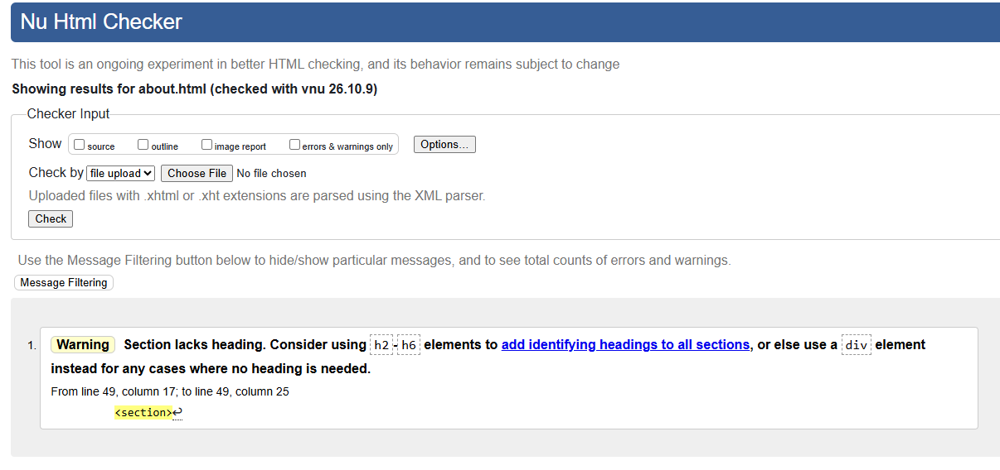
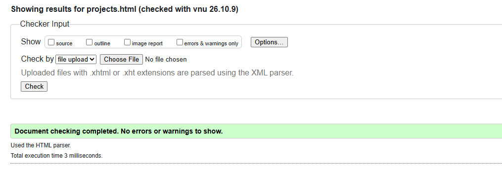
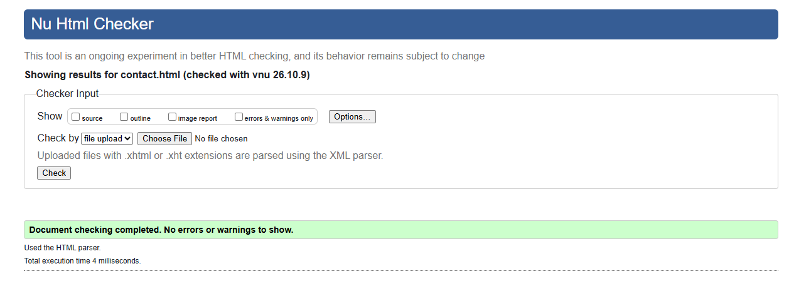
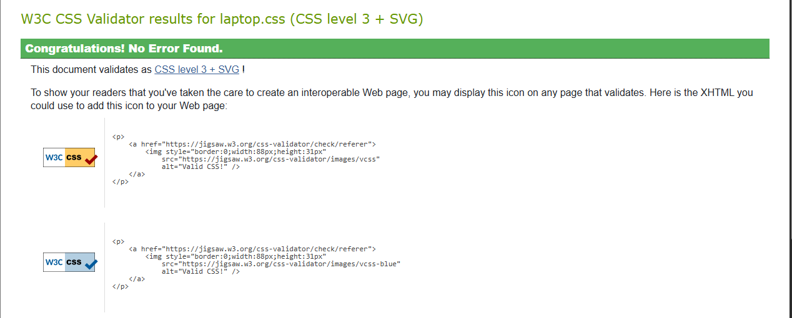
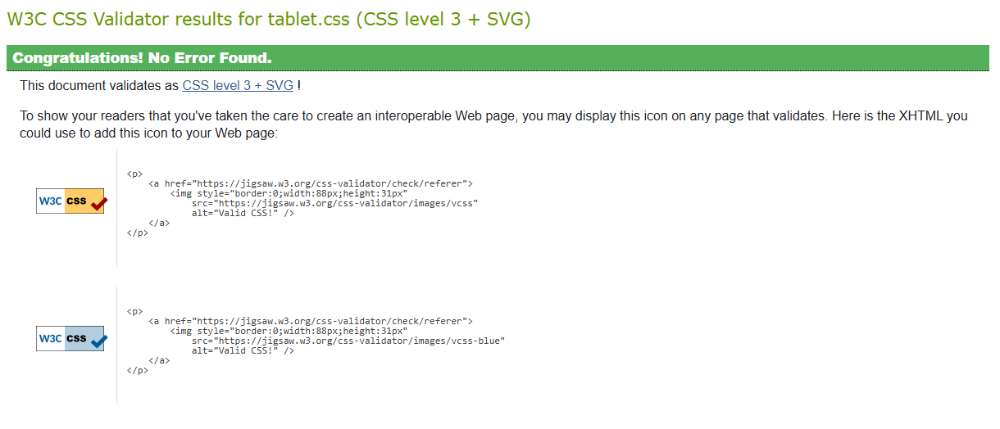
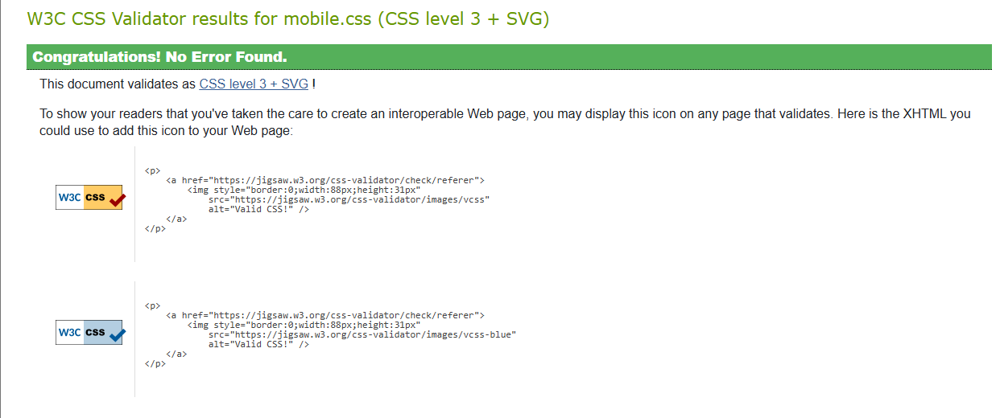

# INFR-3120U Assignment 1 
Fazal Naqvi 100975935

the github repo: https://github.com/fazalnaqvi/Portfolio

Link to website:https://fazalnaqvi.github.io/Portfolio/

written using VS code

The viewport sizes that were used was 3 different CSS files, 
one for each screen size. Each page is able to link all three and a media qeury decides
which one loads. 
I got these from the Week 3 lecture

for mobile.css it is 480px wide
for tablet.css it is 481 - 959 px 
for laptop css it is 960x 

fluid design is used and are in precentage instead of fixed pixels, this is
so that when the screen is resized the website is moved with it

the gradents used is both linear gradiant and anled linear gradiant.

Linear gradiant was used for the header of all 4 pages "linear-gradient(to right, #F5C700 0%, #B7E7FC 100%)" it goes from yellow
ont he left to skyblye on the left. its in the header rule in all 3 css files

Angled Linear tradiant was used for the big intro box aka .hero on the home page "linear-gradient(135deg, #B7E7FC 0%, #F5C700 100%)" it goes from sky blue to yellow at a 135 degree angle. it is in .hero rule in all three css files

for my color scheme, i made it in Adobe color
link: https://color.adobe.com/create/color-wheel?color-palette=2A0081%2CB7E7FC%2CFFFDFE%2CF5C700%2CE3A2B9&color-palette-name=My+Color+Theme

the different colors used are:
yellow (#F5C700) for the header and hero gradients, project box stripe, send button and fotter email link
White (#FFFDFE) for the page background
Purple (#2A0081) for all the text, footer, hero buttons and form borders
SkyBlue (#B7E7FC) head and hero gradients, project boxes 

W3C HTML Validator: i checked all 4 html page and all passed

W3C CSS validator: i checked all 3 CSS files and all padded

Most of my code is from the course lectures (weeks 1-4), like the media query, floats and the gradiants and the form fields.

the codes that ive used outside of the lectures was:

Formspree which was used to set up the contact form messages and it messages to my email using formspree linkl in the forms action. I only used the link from their page

I also used a video from youtube titled (LEARN HTML IN 1 HOUR) to help me out with some of the code
Link: https://www.youtube.com/watch?v=HD13eq_Pmp8

